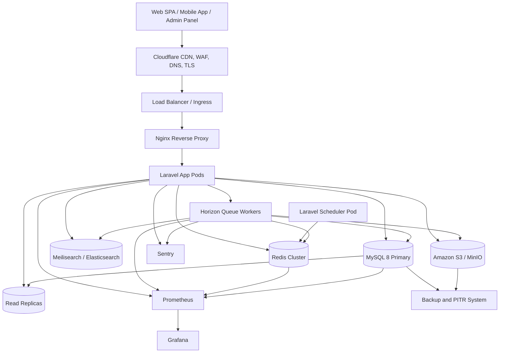
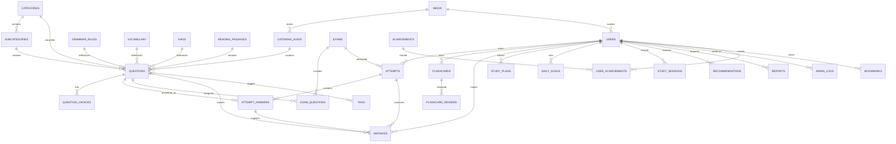
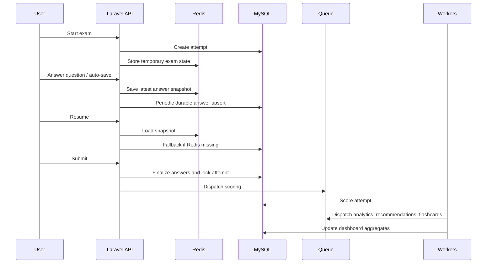
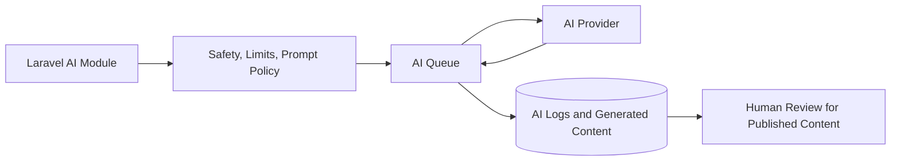

# JLPT/NAT Smart Examination Platform - Software Architecture Document

Version: 1.0  
Target stack: Laravel 12, PHP 8.4, MySQL 8, Redis, Horizon, S3/MinIO, Meilisearch or Elasticsearch, Docker, Nginx, Cloudflare, Kubernetes or Docker Swarm.

## 1. High-Level System Architecture

The platform should be deployed as a horizontally scalable Laravel modular monolith with separate stateless web/API containers, queue worker containers, scheduler containers, Redis, MySQL primary plus replicas, object storage, search, monitoring, and backups. The core rule is simple: web requests stay fast, heavy work moves to queues, durable state lives in MySQL or object storage, and transient state lives in Redis.



### Components

Client: Browser SPA, server-rendered Laravel views, native mobile clients, and admin panel. Clients communicate over HTTPS using session auth for first-party web and Sanctum tokens for mobile/API consumers.

Cloudflare: Provides DNS, TLS termination, CDN caching for static assets and media, WAF rules, DDoS protection, bot mitigation, rate limiting, and edge cache.

Load Balancer / Kubernetes Ingress: Routes traffic to healthy Nginx/Laravel pods. It must use readiness checks so new pods receive traffic only after migrations, cache warming, and app boot are safe.

Nginx: Serves static files, forwards PHP requests to PHP-FPM, applies request size limits, compression, security headers, and timeout rules suitable for exams.

Laravel Application Servers: Stateless containers. They handle API requests, authentication, exam session orchestration, reads, writes, and dispatch jobs. Horizontal scaling is achieved by increasing pod replicas.

Redis: Used for cache, sessions, queues, auto-save snapshots, rate limits, distributed locks, leaderboards, and temporary exam state. In production use Redis Sentinel or managed Redis Cluster.

MySQL Primary: Source of truth for transactional data: users, questions, attempts, answers, flashcards, analytics aggregates, permissions, audit logs, and settings.

Read Replicas: Serve read-heavy screens such as dashboards, question browsing, analytics views, reports, and admin lists. Critical exam writes always go to primary.

Queue Workers: Laravel Horizon workers process analytics, scoring, flashcard generation, recommendation refreshes, emails, notifications, reports, AI tasks, media processing, and search indexing.

Search Engine: Meilisearch is simpler and fast for product-style search. Elasticsearch/OpenSearch is better for large-scale analytics-like search, complex filters, and multilingual scoring. Start with Meilisearch unless search requirements are advanced.

Object Storage: S3 or MinIO stores listening audio, images, reading PDFs, generated reports, exports, and backups. Cloudflare CDN delivers public or signed media.

Monitoring: Laravel Pulse for application health, Horizon for queues, Prometheus for metrics, Grafana for dashboards, Sentry for exceptions and performance traces, Telescope only in non-production.

Backup System: MySQL logical backups, binary logs for point-in-time recovery, S3 versioning, cross-region replication, restore drills, and automated backup verification.

## 2. Application Architecture

Use a modular monolith. This keeps development fast and deployment simple while preserving domain boundaries. A microservice split is premature until team size, deployment ownership, or scaling profiles justify it.

Core patterns:

- DDD modules own their entities, actions, policies, events, jobs, DTOs, and tests.
- Service layer coordinates business workflows that span repositories or external systems.
- Repositories are used only where they add value: complex query reuse, persistence abstraction, or testable domain access.
- Action classes perform single use cases such as `StartExamAttempt`, `SubmitAttempt`, `GenerateFlashcardsFromMistakes`.
- Events record meaningful domain facts: `AttemptSubmitted`, `AnswerMarkedWrong`, `StudyGoalCompleted`.
- Listeners perform side effects or dispatch jobs.
- Jobs process heavy or retryable work.
- Policies centralize authorization.
- Notifications use mail, database, push, and broadcast channels.

Recommended folder structure:

```text
app/
  Modules/
    Auth/
      Actions/
      DTOs/
      Events/
      Http/Controllers/
      Http/Requests/
      Models/
      Policies/
      Services/
      Tests/
    Exams/
    Attempts/
    Questions/
    Flashcards/
    Analytics/
    Recommendations/
    AiTutor/
    Admin/
  Shared/
    Actions/
    Casts/
    DTOs/
    Enums/
    Exceptions/
    Http/
    Models/
    Observers/
    QueryBuilders/
    Services/
    Support/
  Console/
  Providers/
bootstrap/
config/
database/
  migrations/
  seeders/
routes/
  api.php
  web.php
  admin.php
tests/
  Feature/
  Unit/
  Architecture/
```

Why each area exists:

- `Modules`: keeps domain code together and prevents unrelated features from becoming tangled.
- `Shared`: contains cross-cutting utilities and abstractions that are stable and genuinely reused.
- `Actions`: one class per business operation; easier to test than large controllers.
- `DTOs`: typed data boundaries between controllers, actions, jobs, and external APIs.
- `Enums`: stable domain states such as `AttemptStatus`, `JlptLevel`, `QuestionType`.
- `Policies`: all resource authorization is explicit and testable.
- `QueryBuilders`: reusable filters for admin tables, dashboards, and APIs.
- `Tests/Architecture`: ensures module dependency rules remain intact.

## 3. Module Design

Authentication: Registration, login, password reset, device/session management, 2FA, Sanctum tokens, social login if needed.

Users: Profiles, preferences, target JLPT/NAT level, locale, timezone, learning settings, user statistics.

Roles and Permissions: RBAC for student, teacher, content editor, examiner, support, admin, super admin.

Questions: Question bank, choices, explanation, difficulty, level, type, media references, tags, review workflow, versioning.

Content Taxonomy: Categories, subcategories, grammar rules, vocabulary, kanji, reading passages, listening audio.

Exams: Exam templates, official distribution, sections, time limits, publication state, visibility, assigned questions.

Exam Engine: Generates exam instances, enforces timing, shuffling, resume behavior, anti-abuse checks, and submission rules.

Attempt Engine: Tracks started attempts, answers, auto-save, final submission, scoring status, and review availability.

Scoring Engine: Calculates section scores, pass/fail, scaled scoring rules, partial credit if introduced, and explanations.

Analytics: Aggregates learning behavior, weak areas, accuracy trends, time spent, question difficulty, and content performance.

Recommendations: Creates next-study suggestions, weak-topic remediation, flashcard priorities, and study plans.

Mistake Notebook: Stores wrong answers, user notes, correction state, and retry history.

Flashcards: User-owned cards generated manually, from mistakes, vocabulary, grammar, kanji, or AI explanations.

Spaced Repetition: Schedules reviews using SM-2 or FSRS-inspired intervals, ease factors, lapses, and due dates.

AI Tutor: AI explanations, grammar tutor, vocabulary tutor, kanji tutor, chat assistant, OCR, speech recognition, writing correction, and conversation practice.

Notifications: Email, in-app, push, reminders, exam deadlines, review due reminders, achievements.

Admin Panel: Content management, moderation, user management, exam creation, reports, audit log viewing, system settings.

Reports: User exports, admin analytics, exam result reports, CSV/PDF generation.

Media: Upload validation, audio/image/PDF storage, signed URLs, conversion jobs, metadata, and lifecycle rules.

Settings: Feature flags, global configuration, exam rules, AI limits, maintenance mode, cache invalidation hooks.

## 4. Complete Database Design

Use InnoDB, `utf8mb4`, strict mode, UTC timestamps, bigint unsigned identifiers, and explicit foreign keys where write volume allows. For very high-volume event tables, use fewer foreign keys but keep indexed logical references and validate at application level.

### Identity and Access

`users`

| Column | Type | Notes |
|---|---|---|
| id | BIGINT UNSIGNED PK | Primary key |
| name | VARCHAR(120) | Display name |
| email | VARCHAR(190) UNIQUE | Login identity |
| email_verified_at | TIMESTAMP NULL | Verification |
| password | VARCHAR(255) | Argon2id hash |
| avatar_media_id | BIGINT UNSIGNED NULL FK media.id | Avatar |
| target_level | ENUM('N5','N4','N3','N2','N1','NAT_5','NAT_4','NAT_3','NAT_2','NAT_1') | Goal |
| locale | VARCHAR(10) | UI language |
| timezone | VARCHAR(64) | User timezone |
| status | ENUM('active','blocked','deleted') | Account state |
| last_login_at | TIMESTAMP NULL | Audit |
| remember_token | VARCHAR(100) NULL | Laravel |
| created_at, updated_at | TIMESTAMP | Laravel |

Indexes: unique `email`; index `status,target_level` for admin filters; index `created_at` for growth analytics.

`roles`: `id`, `name` unique, `guard_name`, `description`, timestamps. Index `name,guard_name`.

`permissions`: `id`, `name` unique, `guard_name`, `description`, timestamps. Index `name,guard_name`.

`model_has_roles`: `role_id` FK, `model_type`, `model_id`; PK `role_id,model_id,model_type`; index `model_id,model_type`.

`model_has_permissions`: `permission_id` FK, `model_type`, `model_id`; PK `permission_id,model_id,model_type`; index `model_id,model_type`.

`role_has_permissions`: `role_id` FK, `permission_id` FK; composite PK.

### Taxonomy and Learning Content

`categories`: `id`, `name`, `slug` unique, `type` ENUM('vocabulary','grammar','kanji','listening','reading','exam'), `sort_order`, timestamps. Index `type,sort_order`.

`subcategories`: `id`, `category_id` FK, `name`, `slug`, `sort_order`, timestamps. Unique `category_id,slug`; index `category_id,sort_order`.

`grammar_rules`: `id`, `level`, `title`, `slug` unique, `structure`, `meaning`, `formation`, `examples` JSON, `category_id` FK, timestamps. Index `level,category_id`.

`vocabulary`: `id`, `level`, `word`, `reading`, `meaning`, `part_of_speech`, `example_sentence`, `audio_media_id` FK nullable, timestamps. Indexes `level,word`, `reading`, full-text/search index externally.

`kanji`: `id`, `level`, `character` CHAR(1) unique, `onyomi`, `kunyomi`, `meaning`, `stroke_count`, `radical`, `examples` JSON, timestamps. Indexes `level,stroke_count`, `radical`.

`reading_passages`: `id`, `level`, `title`, `body` LONGTEXT, `source`, `difficulty`, `estimated_seconds`, timestamps. Index `level,difficulty`.

`listening_audio`: `id`, `level`, `title`, `media_id` FK, `duration_seconds`, `transcript` LONGTEXT nullable, `speaker_meta` JSON, timestamps. Index `level,duration_seconds`.

### Questions

`questions`

| Column | Type | Notes |
|---|---|---|
| id | BIGINT UNSIGNED PK | Primary key |
| uuid | CHAR(36) UNIQUE | External stable id |
| level | ENUM | JLPT/NAT level |
| section | ENUM('language_knowledge','reading','listening') | Exam section |
| type | ENUM('single_choice','multi_choice','fill_blank','ordering','listening_choice','reading_choice') | Rendering/scoring |
| category_id | BIGINT FK | Category |
| subcategory_id | BIGINT FK NULL | Subcategory |
| grammar_rule_id | BIGINT FK NULL | Related grammar |
| vocabulary_id | BIGINT FK NULL | Related word |
| kanji_id | BIGINT FK NULL | Related kanji |
| reading_passage_id | BIGINT FK NULL | Passage |
| listening_audio_id | BIGINT FK NULL | Audio |
| prompt | TEXT | Question text |
| explanation | TEXT NULL | Human explanation |
| difficulty | TINYINT | 1-10 |
| points | DECIMAL(6,2) | Raw points |
| status | ENUM('draft','review','published','archived') | Workflow |
| metadata | JSON | Extra rendering data |
| created_by | BIGINT FK users.id | Author |
| reviewed_by | BIGINT FK users.id NULL | Reviewer |
| published_at | TIMESTAMP NULL | Visibility |
| created_at, updated_at, deleted_at | TIMESTAMP | Soft delete |

Indexes: `level,section,type,status`; `category_id,subcategory_id`; `difficulty,status`; `published_at`; `created_by`; `reading_passage_id`; `listening_audio_id`. These support random generation, admin filtering, and content relationship lookup.

`question_choices`: `id`, `question_id` FK, `choice_key` VARCHAR(10), `body` TEXT, `is_correct` BOOLEAN, `sort_order` SMALLINT, `explanation` TEXT NULL, timestamps. Index `question_id,sort_order`; index `question_id,is_correct`.

`tags`: `id`, `name`, `slug` unique, `type` nullable, timestamps. Index `type,name`.

`question_tags`: `question_id` FK, `tag_id` FK, composite PK. Reverse index `tag_id,question_id`.

`bookmarks`: `id`, `user_id` FK, `bookmarkable_type`, `bookmarkable_id`, `note` TEXT NULL, timestamps. Unique `user_id,bookmarkable_type,bookmarkable_id`; index `bookmarkable_type,bookmarkable_id`.

### Exams and Attempts

`exams`: `id`, `uuid` unique, `title`, `level`, `exam_type` ENUM('practice','mock','official_simulator','custom'), `description`, `duration_seconds`, `section_rules` JSON, `blueprint` JSON, `status`, `created_by` FK, `published_at`, timestamps. Indexes `level,exam_type,status`, `published_at`.

`exam_questions`: `id`, `exam_id` FK, `question_id` FK, `section`, `sort_order`, `points`, `is_required` BOOLEAN, timestamps. Unique `exam_id,question_id`; index `exam_id,section,sort_order`; index `question_id`.

`attempts`: `id`, `uuid` unique, `user_id` FK, `exam_id` FK nullable, `level`, `exam_type`, `status` ENUM('started','paused','submitted','scoring','scored','expired','cancelled'), `started_at`, `submitted_at`, `expires_at`, `duration_seconds`, `score_raw`, `score_scaled`, `passed` BOOLEAN NULL, `section_scores` JSON, `metadata` JSON, timestamps. Indexes `user_id,status,created_at`; `exam_id,status`; `status,expires_at`; `submitted_at`.

`attempt_answers`: `id`, `attempt_id` FK, `question_id` FK, `selected_choice_id` FK nullable, `answer_payload` JSON, `is_correct` BOOLEAN NULL, `points_awarded` DECIMAL(6,2), `answered_at`, `time_spent_seconds`, `revision_count`, timestamps. Unique `attempt_id,question_id`; indexes `question_id,is_correct`; `attempt_id,answered_at`.

`mistakes`: `id`, `user_id` FK, `attempt_id` FK, `question_id` FK, `attempt_answer_id` FK, `reason` ENUM('wrong','blank','slow','guessed'), `status` ENUM('open','reviewing','resolved'), `user_note` TEXT NULL, `resolved_at` TIMESTAMP NULL, timestamps. Indexes `user_id,status,created_at`; `question_id`; `attempt_id`.

### Flashcards and Study

`flashcards`: `id`, `user_id` FK, `source_type`, `source_id`, `front` TEXT, `back` TEXT, `level`, `card_type` ENUM('vocabulary','kanji','grammar','mistake','custom'), `metadata` JSON, `status`, timestamps. Indexes `user_id,status,card_type`; `source_type,source_id`.

`flashcard_reviews`: `id`, `flashcard_id` FK, `user_id` FK, `rating` TINYINT, `reviewed_at`, `scheduled_for`, `interval_days`, `ease_factor` DECIMAL(4,2), `lapses`, `response_ms`, timestamps. Indexes `user_id,scheduled_for`; `flashcard_id,reviewed_at`; partition candidate by `reviewed_at`.

`study_plans`: `id`, `user_id` FK, `level`, `title`, `starts_on`, `ends_on`, `status`, `plan_payload` JSON, timestamps. Index `user_id,status,starts_on`.

`daily_goals`: `id`, `user_id` FK, `goal_date` DATE, `target_reviews`, `target_questions`, `target_minutes`, `completed_reviews`, `completed_questions`, `completed_minutes`, timestamps. Unique `user_id,goal_date`.

`study_sessions`: `id`, `user_id` FK, `started_at`, `ended_at`, `duration_seconds`, `activity_type`, `metadata` JSON, timestamps. Indexes `user_id,started_at`; `activity_type,started_at`.

`learning_history`: `id`, `user_id` FK, `entity_type`, `entity_id`, `activity`, `result`, `occurred_at`, `metadata` JSON. Indexes `user_id,occurred_at`; `entity_type,entity_id`; partition candidate by `occurred_at`.

`achievements`: `id`, `code` unique, `name`, `description`, `criteria` JSON, `points`, `badge_media_id` FK nullable, timestamps.

`user_achievements`: `id`, `user_id` FK, `achievement_id` FK, `earned_at`, `metadata` JSON. Unique `user_id,achievement_id`; index `earned_at`.

### Recommendations, Analytics, and Reporting

`recommendations`: `id`, `user_id` FK, `type`, `priority` TINYINT, `title`, `reason`, `payload` JSON, `status` ENUM('active','dismissed','completed','expired'), `expires_at`, timestamps. Index `user_id,status,priority`; index `expires_at`.

`analytics_events`: `id`, `user_id` nullable FK, `event_name`, `entity_type`, `entity_id`, `occurred_at`, `properties` JSON. Indexes `event_name,occurred_at`; `user_id,occurred_at`; partition by month for scale.

`dashboard_statistics`: `id`, `user_id` FK nullable, `scope` ENUM('user','global','level'), `scope_key`, `stat_date` DATE, `metrics` JSON, timestamps. Unique `scope,scope_key,stat_date`; index `user_id,stat_date`.

`reports`: `id`, `user_id` FK, `type`, `status`, `filters` JSON, `media_id` FK nullable, `requested_at`, `completed_at`, `error_message` TEXT nullable, timestamps. Indexes `user_id,status,created_at`; `type,status`.

### System, Media, and Operations

`notifications`: Laravel database notification table with `id` UUID PK, `type`, `notifiable_type`, `notifiable_id`, `data` JSON, `read_at`, timestamps. Index `notifiable_type,notifiable_id,read_at`.

`admin_logs`: `id`, `admin_user_id` FK, `action`, `auditable_type`, `auditable_id`, `before` JSON, `after` JSON, `ip_address`, `user_agent`, timestamps. Indexes `admin_user_id,created_at`; `auditable_type,auditable_id`; `action,created_at`.

`system_logs`: `id`, `level`, `channel`, `message`, `context` JSON, `created_at`. Index `level,created_at`; partition by `created_at`. Critical logs should also go to centralized logging.

`settings`: `id`, `group`, `key`, `value` JSON, `type`, `is_public` BOOLEAN, timestamps. Unique `group,key`; index `is_public`.

`media`: `id`, `disk`, `path`, `original_name`, `mime_type`, `size_bytes`, `checksum`, `visibility`, `uploaded_by` FK nullable, `metadata` JSON, timestamps. Unique `disk,path`; index `mime_type`; index `uploaded_by,created_at`.

### Normalization

The design keeps users, content, attempts, answers, and learning artifacts in separate normalized tables to avoid update anomalies and duplicated content. JSON is used only for flexible metadata, exam blueprints, generated plans, and analytics payloads where schema changes are frequent. High-value query fields are promoted to typed columns and indexed.

## 5. ER Diagram



## 6. Database Performance

Index strategy: every foreign key gets an index; every frequent filter/sort pair gets a composite index; low-cardinality columns are indexed only when combined with selective columns. Examples: `attempts(user_id,status,created_at)`, `questions(level,section,type,status)`, `flashcard_reviews(user_id,scheduled_for)`.

Composite indexes: design left-to-right for query predicates. For a due-review query, `user_id,scheduled_for` allows fast retrieval of a user's due cards. For exam generation, `level,section,type,status,difficulty` narrows the question pool.

Covering indexes: admin list screens should select only fields covered by indexes where possible, such as `questions(level,status,updated_at,id)` for moderation queues.

Foreign key optimization: keep FKs for core transactional tables. For write-heavy event logs, use logical references plus indexes to reduce write amplification.

Partitioning: partition `analytics_events`, `learning_history`, `system_logs`, and eventually `flashcard_reviews` by month or quarter. This keeps pruning, archiving, and retention efficient.

Read replicas: route safe reads to replicas using Laravel read/write connections. Avoid replica reads immediately after critical writes unless the request can tolerate lag.

Connection pooling: use ProxySQL, MySQL Router, or managed database pooling. PHP-FPM and Horizon can create many connections, so configure max workers and pool size deliberately.

Query optimization: use `EXPLAIN ANALYZE`, avoid N+1 queries, paginate with cursor pagination for large tables, use summary tables for dashboards, and avoid counting millions of rows synchronously.

Millions of rows: attempts and answers scale by indexing `attempt_id`, `user_id`, and time columns, archiving old attempts if policy allows, and computing dashboards asynchronously into aggregate tables.

## 7. Question Engine

Random exam generator:

1. Load an exam blueprint for level and exam type.
2. For each section, define required counts by type, category, and difficulty.
3. Exclude recently seen questions using user history.
4. Select candidate IDs using indexed filters.
5. Randomize from candidate IDs in application memory rather than `ORDER BY RAND()` on large tables.
6. Persist selected question IDs into `exam_questions` for fixed exams or attempt metadata for generated exams.

Real exam simulator: uses official JLPT-like section timing, distribution, question ordering rules, listening playback constraints, and strict submission windows.

Official distribution: store per-level blueprints in JSON settings or a dedicated `exam_blueprints` table if they become complex. Example fields: section, question type, count, points, target difficulty, time limit.

Question shuffling: shuffle choices per attempt and store the presented order in `attempt_answers.answer_payload` or attempt metadata so review is deterministic.

Listening timing: audio playback state is controlled client-side but validated server-side with section start time, elapsed time, and signed media URLs. Prevent replay if the exam mode requires single play.

Reading timing: section timers are based on server timestamps. Client timers are display-only. Auto-submit occurs when `expires_at` is reached.

## 8. Exam Engine



Steps:

Exam Start: Validate eligibility, create `attempts` row, generate/select questions, calculate `expires_at`, store question and choice order.

Auto Save: Client sends answer deltas every few seconds and on navigation. API writes to Redis immediately and periodically upserts MySQL rows.

Redis: Holds hot attempt state with TTL slightly longer than exam duration. It improves responsiveness but is not the only durable store.

Resume: API returns Redis snapshot when available, otherwise rebuilds from MySQL `attempt_answers`.

Submit: Use a DB transaction and Redis lock to prevent double submission. Mark attempt as `submitted` or `scoring`.

Scoring: Queue job evaluates answers, stores raw and scaled scores, creates mistakes, emits `AttemptScored`.

Analytics: Jobs update weak areas, time metrics, question statistics, and dashboard aggregates.

Recommendations: Jobs generate next actions based on mistakes, speed, accuracy, and due flashcards.

Flashcards: Wrong answers and weak vocabulary/grammar can generate suggested cards.

Dashboard: Reads from precomputed statistics, not raw answer scans.

## 9. Queue Architecture

Queue lanes:

- `critical`: scoring, exam finalization recovery.
- `default`: analytics, recommendations, dashboard updates.
- `notifications`: email, push, in-app notifications.
- `media`: audio/image processing, PDF generation.
- `ai`: AI explanations, tutoring responses, OCR, speech tasks.
- `exports`: CSV/PDF reports.
- `search`: indexing questions, vocabulary, kanji.

Queued operations: analytics, flashcard creation, email, achievement calculation, AI explanation generation, report generation, recommendation engine, notification sending, search indexing, media processing, dashboard aggregation, pass probability calculation.

Worker scaling: Horizon supervisors are split by queue. During exams, scale `critical` and `default` workers. AI and exports must have strict concurrency limits so they cannot starve scoring.

Retry rules: scoring jobs should be idempotent with short retries; AI jobs can have longer retries and backoff; notifications can tolerate delayed retries.

## 10. Cache Strategy

Cache categories, subcategories, grammar lists, vocabulary lookups, kanji metadata, exam blueprints, leaderboard pages, dashboard aggregates, search suggestions, question metadata, public settings, permissions, and feature flags.

Use cache tags if supported by the Redis driver conventions in the application. Invalidation should happen in model observers or domain events: `QuestionPublished` invalidates question metadata and search index; `SettingsUpdated` invalidates settings; `AttemptScored` invalidates user dashboard.

TTL guidance: static taxonomy 6-24 hours, user dashboard 1-10 minutes, leaderboards 1-5 minutes, exam blueprints 30-60 minutes with event invalidation, permissions 5-30 minutes.

## 11. Redis Design

Sessions: store Laravel sessions in Redis for stateless app servers.

Cache: application cache, tagged caches, computed dashboards, public content.

Queues: Redis queues managed by Horizon.

Leaderboards: sorted sets such as `leaderboard:weekly:N3` with score and user ID.

Rate limiting: throttle login, exam start, AI chat, and public APIs.

Auto-save: keys like `attempt:{attempt_id}:snapshot` with TTL.

Temporary exams: generated question order, shuffled choices, section timers.

Locks: `Cache::lock("attempt-submit:$id")` prevents duplicate submission; locks also protect recommendation rebuilds and report generation.

Distributed mutex: use Redis locks for idempotent scheduled jobs in multi-pod deployments.

## 12. Search Architecture

Recommended default: Meilisearch for fast search, typo tolerance, easy Laravel Scout integration, and low operational complexity. Use Elasticsearch/OpenSearch if requirements include complex aggregations, custom Japanese analyzers, multi-tenant search isolation at very large scale, or advanced observability.

Question indexing: index published questions with ID, level, section, type, category, subcategory, tags, prompt text, explanation text, difficulty, and content references. Do not index unpublished private drafts for public users.

Vocabulary search: index `word`, `reading`, `meaning`, level, part of speech, tags, and example sentence. Configure synonyms and Japanese tokenization if using Elasticsearch.

Kanji search: index character, readings, meaning, radical, stroke count, level, and examples.

Indexing flow: content write emits domain event, listener dispatches indexing job, job updates search document, and failed indexing appears in Horizon/Sentry.

## 13. Storage Architecture

Audio: store original and optimized audio in S3/MinIO. Use signed URLs for private exam audio and CDN URLs for public samples.

Images: validate MIME, dimensions, and size. Generate thumbnails asynchronously. Store checksums to deduplicate.

Reading PDFs: store uploaded source PDFs privately; generated reports may be private signed downloads.

Backups: database backups and exported reports go to a separate backup bucket with object lock where possible.

Versioning: enable S3 bucket versioning for media and backup buckets. Use lifecycle rules for old derived files.

CDN delivery: Cloudflare caches public media. Private exam media should use short-lived signed routes or signed object URLs.

## 14. Security Architecture

Authentication: Laravel session auth for web, Sanctum for mobile/API, optional social login, email verification, device/session management.

Authorization: RBAC plus Laravel Policies. Roles grant broad permissions; policies enforce resource-specific ownership and state rules.

CSRF: enabled for web forms and session APIs.

XSS: Blade escaping, content sanitization for admin-entered rich text, strict CSP, avoid unsafe HTML rendering.

SQL injection prevention: Eloquent/query builder bindings, no raw interpolated SQL, reviewed raw expressions.

Rate limiting: login, password reset, exam start, answer autosave, AI calls, reports, and public APIs.

Password hashing: Argon2id with strong parameters; rehash on login when configuration changes.

Encryption: TLS everywhere, encrypted environment secrets, Laravel encrypted casts for sensitive fields, KMS-managed S3 encryption.

Secure uploads: validate extension and MIME, scan if possible, store outside web root, generate random paths, disallow executable uploads.

Signed URLs: private media and report downloads require signed temporary URLs.

Audit logging: record admin actions, permission changes, content publication, exam changes, user blocking, and settings changes.

API security: Sanctum scopes, CORS restrictions, request validation, response minimization, idempotency keys for submissions, replay protection for sensitive endpoints.

2FA: required for admins; optional for students.

## 15. API Design

Use `/api/v1`. Responses should be JSON with stable error shapes and request IDs.

Authentication:

```http
POST /api/v1/auth/login
{
  "email": "student@example.com",
  "password": "secret",
  "device_name": "Chrome"
}
```

```json
{
  "token": "plain-text-token-once",
  "user": {"id": 1, "name": "Aye", "target_level": "N3"}
}
```

Questions:

- `GET /api/v1/questions?level=N3&section=reading`
- `GET /api/v1/questions/{id}`
- `POST /api/v1/admin/questions`
- `PATCH /api/v1/admin/questions/{id}`
- `POST /api/v1/admin/questions/{id}/publish`

Exams:

- `GET /api/v1/exams`
- `GET /api/v1/exams/{id}`
- `POST /api/v1/exams/{id}/start`

Attempt answer:

```http
PATCH /api/v1/attempts/{attempt}/answers/{question}
{
  "selected_choice_id": 123,
  "time_spent_seconds": 41,
  "client_saved_at": "2026-07-12T15:22:00Z"
}
```

Attempt submit:

```http
POST /api/v1/attempts/{attempt}/submit
Idempotency-Key: 4b89a1e6-2f36-4f26-9954-0f6c6d
```

```json
{
  "attempt_id": 9001,
  "status": "scoring",
  "result_url": "/api/v1/attempts/9001/result"
}
```

Dashboard:

- `GET /api/v1/dashboard`
- `GET /api/v1/dashboard/weak-areas`

Analytics:

- `GET /api/v1/analytics/progress`
- `GET /api/v1/analytics/accuracy?level=N3`

Flashcards:

- `GET /api/v1/flashcards/due`
- `POST /api/v1/flashcards`
- `POST /api/v1/flashcards/{id}/review`

Recommendations:

- `GET /api/v1/recommendations`
- `POST /api/v1/recommendations/{id}/dismiss`

AI:

- `POST /api/v1/ai/explain-question`
- `POST /api/v1/ai/chat`
- `POST /api/v1/ai/ocr`
- `POST /api/v1/ai/speech/assess`

Notifications:

- `GET /api/v1/notifications`
- `PATCH /api/v1/notifications/{id}/read`

Admin:

- `GET /api/v1/admin/users`
- `GET /api/v1/admin/reports`
- `GET /api/v1/admin/audit-logs`
- `PATCH /api/v1/admin/settings/{group}/{key}`

## 16. Background Jobs

`ScoreAttemptJob`: scores submitted attempts idempotently.

`CreateMistakesFromAttemptJob`: creates mistake notebook entries.

`CalculateUserAnalyticsJob`: updates weak areas, accuracy, speed, and trends.

`UpdateDashboardStatisticsJob`: writes dashboard summary rows.

`GenerateFlashcardsFromMistakesJob`: creates suggested cards from wrong answers.

`SendStudyReminderJob`: sends reminders based on due cards and goals.

`CalculateAchievementsJob`: checks streaks, volume, pass score milestones.

`GenerateAiExplanationJob`: produces explanation drafts with moderation.

`UpdateStudyPlanJob`: adjusts study plan after exam performance changes.

`PredictPassProbabilityJob`: estimates pass chance from recent performance.

`GenerateReportJob`: creates PDF/CSV reports and stores them in object storage.

`IndexSearchDocumentJob`: updates Meilisearch/Elasticsearch.

`ProcessUploadedMediaJob`: extracts metadata, transcodes audio, generates thumbnails.

## 17. AI Integration

Design AI as an optional bounded subsystem, not a dependency required for exam completion.



AI explanations: generated asynchronously after wrong answers or on-demand with per-user limits. Cache accepted explanations.

Grammar tutor: prompt with grammar rule, examples, user level, and mistake history.

Vocabulary tutor: create contextual examples, cloze cards, and mnemonics.

Kanji tutor: radicals, readings, stroke hints, and example compounds.

Study recommendations: combine deterministic rules with AI-generated wording. The decision should remain explainable.

Chat assistant: scoped to learning content; use retrieval augmented generation over approved grammar/vocabulary/question documents.

OCR: accepts image uploads, extracts Japanese text, turns unknown words into vocabulary cards.

Speech recognition: assess pronunciation and listening responses; queue processing and store media securely.

Writing correction: rubric-based correction for grammar, vocabulary, naturalness, and JLPT level.

Conversation practice: real-time or turn-based practice with strict usage limits, transcript storage, and safety filtering.

## 18. Scaling Strategy

100 users: single VPS or small cloud instance, Docker Compose, one MySQL, one Redis, local MinIO optional, basic backups.

1,000 users: separate app, DB, Redis, and object storage; Horizon workers; Cloudflare; Sentry; scheduled backups; CI/CD.

10,000 users: multiple app containers behind load balancer, managed MySQL with read replica, Redis HA, separate worker nodes, search engine, Prometheus/Grafana.

100,000 users: Kubernetes, autoscaling app and workers, MySQL primary plus replicas, partitioned high-volume tables, CDN-heavy media delivery, queue isolation, blue-green deploys, disaster recovery environment.

1 million users: multi-region read delivery, dedicated analytics pipeline, data warehouse, sharded or horizontally partitioned hot tables if needed, managed search cluster, event streaming, stronger tenant isolation if schools/organizations are introduced.

## 19. Fault Tolerance

Database failover: use managed MySQL HA or orchestrated primary failover. App must retry transient connection failures and avoid long transactions.

Redis failover: use managed Redis HA, Sentinel, or Cluster. Critical exam state must also be periodically persisted to MySQL.

Queue recovery: jobs are idempotent, retryable, and monitored. Failed jobs are alerted and replayed after root cause fix.

Automatic restart: containers use liveness probes and restart policies.

Health checks: `/health/live` for process health, `/health/ready` for dependencies and migration compatibility.

Circuit breakers: protect AI provider, email provider, search, and non-critical integrations. Exams must continue if AI or recommendations are down.

Retries: exponential backoff with jitter for network dependencies.

Graceful degradation: if search is down, fall back to database filters; if AI is down, show human explanations; if dashboard aggregates lag, show last computed values.

## 20. Monitoring

Laravel Horizon: queue throughput, wait time, failures, worker status.

Laravel Pulse: requests, slow queries, exceptions, cache, queues, users, and application-level performance.

Grafana and Prometheus: CPU, memory, pod restarts, HTTP latency, MySQL connections, Redis memory, queue depth, disk usage, ingress errors.

Sentry: exceptions, release tracking, performance traces, failed user flows, frontend errors.

Alerts: high error rate, high p95 latency, failed scoring jobs, queue lag, MySQL replica lag, backup failure, Redis memory pressure, disk saturation, certificate expiry.

Slow queries: collect query samples and run regular index reviews.

## 21. Backup Strategy

Daily backup: full MySQL backup every day, encrypted and stored separately.

Incremental backup: binary logs for point-in-time recovery.

Point-in-time recovery: retain binlogs for at least 7-30 days depending on compliance and cost.

Disaster recovery: documented RTO/RPO, restore automation, standby infrastructure, DNS failover plan.

Geo redundancy: replicate backups and critical S3 buckets to another region.

Restore drills: test restore monthly. A backup that is never restored is not proven.

## 22. Deployment

Docker: separate images for app, worker, scheduler, and Nginx if needed. Build immutable images in CI.

Docker Compose: development environment with PHP-FPM, Nginx, MySQL, Redis, MinIO, Meilisearch, Mailpit.

Kubernetes: recommended for production at scale. Use Deployments for app and workers, CronJob or single scheduler Deployment, HPA for scaling, Secrets, ConfigMaps, Services, Ingress, and PodDisruptionBudgets.

CI/CD with GitHub Actions:

1. Install dependencies.
2. Run Pint, PHPStan/Larastan, architecture tests, unit tests, feature tests.
3. Build Docker image.
4. Scan image.
5. Push image.
6. Deploy to staging.
7. Run smoke tests.
8. Promote to production.

Zero downtime: run backward-compatible migrations first, deploy code, then run cleanup migrations later. Avoid destructive schema changes in the same release.

Blue-green deployment: run new version beside old version, switch traffic after health checks.

Rolling deployment: update pods gradually with readiness checks.

Rollback: keep previous image and migration strategy compatible. Do not rely on rolling back destructive migrations.

Health checks: readiness requires app boot, DB connectivity, Redis connectivity, and config loaded.

## 23. Performance Optimization

Eager loading: always eager load known relationships for lists and dashboards.

Lazy loading: disable accidental lazy loading in non-production and catch N+1 issues.

Chunking: use `chunkById` for batch jobs.

Cursor pagination: use for large user, question, attempt, and report lists.

Query optimization: select only needed columns, use aggregates tables, avoid synchronous heavy counts.

Caching: cache taxonomy, settings, exam blueprints, dashboard aggregates, and public content.

Database indexing: review indexes against real queries and remove unused indexes that hurt writes.

HTTP caching: cache public static assets aggressively with versioned filenames.

Compression: Brotli/Gzip through Nginx or Cloudflare.

CDN: deliver assets, images, audio samples, and public media from Cloudflare.

Image optimization: resize, compress, and serve modern formats.

Queue optimization: separate queues by latency requirements and set worker memory/time limits.

## 24. Coding Standards

Use PSR-12, Laravel Pint, PHPStan/Larastan at a high level, Rector for safe upgrades, and strict types where practical.

SOLID: controllers thin, actions focused, domain services cohesive, dependencies injected.

Clean Architecture: domain rules should not depend directly on controllers or infrastructure details.

DDD: modules represent business capabilities and communicate through actions/events.

Repository Pattern: use selectively for complex query/persistence boundaries.

Service Pattern: use for orchestration that is larger than a single action but still domain-specific.

DTOs: use for validated input and job payloads.

Value Objects: use for score, level, exam duration, answer payload, and scheduled review data when invariants matter.

Enums: use PHP backed enums for statuses, levels, sections, roles, question types.

Events and Observers: use events for domain facts; observers for technical reactions like cache invalidation.

Testing strategy: unit tests for scoring and spaced repetition, feature tests for APIs, integration tests for queues/search/storage, policy tests, migration tests, browser tests for exam flows, load tests before major exams.

## 25. Future Architecture

Native mobile app: Sanctum token APIs, push notifications, media signed URLs, offline-capable sync endpoints.

Offline sync: local attempt drafts, conflict resolution, server reconciliation, signed sync windows for exams.

Teacher dashboard: classroom groups, assignments, student progress, teacher permissions.

Multi-school support: introduce organizations, memberships, tenant-aware policies, and tenant-scoped indexes.

Subscriptions and payments: plans, invoices, provider webhooks, entitlements, grace periods.

Certificates: verifiable certificate records, PDF generation, public verification endpoint.

Live exams: scheduled windows, proctoring hooks, real-time announcements, strict admission control.

Video courses: video storage/transcoding, progress tracking, course modules, quizzes.

Community: moderated discussions, comments, reputation, reporting.

Real-time chat: Laravel Reverb or managed WebSocket service, moderation, rate limiting.

Gamification: seasons, leagues, streak protection, badges, quests, leaderboards.

Marketplace: teacher-created content, review workflows, revenue sharing.

Public API: OAuth clients, scopes, quotas, API keys, developer docs, abuse monitoring.

## Architecture Decisions and Trade-Offs

Modular monolith over microservices: lower operational complexity and stronger transactional consistency. Trade-off: module boundaries require discipline and architecture tests.

MySQL over document database: exam attempts, answers, permissions, and analytics aggregates need relational integrity. JSON columns cover flexible metadata without losing relational strengths.

Redis for hot state but MySQL for durability: Redis gives speed for auto-save and locks, while MySQL remains the recoverable source of truth.

Meilisearch first: simpler to operate. Move to Elasticsearch/OpenSearch only when analysis, analyzers, or scale require it.

Queue-first side effects: keeps exam interactions fast and isolates failures. Trade-off: dashboards and recommendations are eventually consistent.

Kubernetes for mature production: best for high availability and autoscaling. Docker Swarm is simpler but has a smaller ecosystem.

